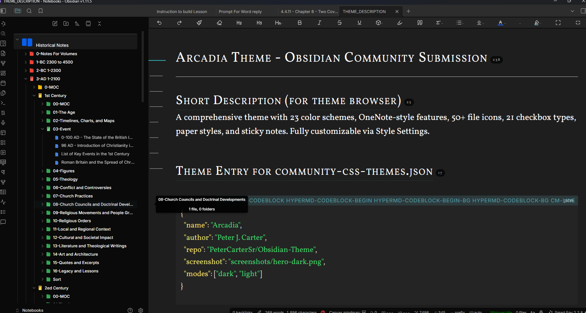

# Arcadia Theme for Obsidian

A comprehensive, professional Obsidian theme with **23 color schemes**, OneNote-style features, and extensive customization through Style Settings.



## Features

### 23 Color Schemes
- **11 Dark Themes:** Default, Granite, Olive, Flint, Navy, Ember, Twilight, Forest, Slate, Amber, Mocha
- **12 Light Themes:** Default Light, Sepia, Ivory, Mist, Sage, Rose, Sand, Frost, Lavender, Cream, NY Times, Wikipedia

### File Icons (50+ Types)
Custom colored icons for documents, code files, media, data formats, and more — making your file explorer instantly scannable.


### Alternate Checkboxes (21 Types)
Beyond standard checkboxes: questions, ideas, pros/cons, stars, bookmarks, quotes, and more.

| Syntax | Icon | Syntax | Icon |
|--------|------|--------|------|
| `- [ ]` | Unchecked | `- [x]` | Checked |
| `- [?]` | Question | `- [!]` | Important |
| `- [i]` | Info | `- [S]` | Star |
| `- [p]` | Pro | `- [c]` | Con |
| `- [b]` | Bookmark | `- ["]` | Quote |


### OneNote-Style Media Embedding
Polished handling for images, videos, and audio:
- Subtle shadows and rounded corners
- Hover effects with smooth transitions
- Custom video player styling
- Pill-shaped audio player


### Paper Styles
Transform your notes with realistic paper backgrounds:
- **Lined Paper** — College ruled lines
- **Grid Paper** — Graph/engineering style
- **Dot Grid** — Bullet journal style
- **Legal Pad** — Yellow legal paper
- **Cornell Notes** — Study-optimized layout


### Sticky Notes Callouts
8 colorful sticky note styles for visual organization:

```markdown
> [!sticky-yellow] Remember
> Don't forget to review Chapter 3

> [!sticky-pink] Important
> Deadline is Friday!
```


### Additional Features
- **Cards View** — Grid layout for notes
- **Rainbow Folders** — Color-coded folder hierarchy
- **Tag Colors** — Visual tag categorization
- **Code Syntax Themes** — Dracula, Nord, GitHub styles
- **Custom Callouts** — Extended callout styling
- **Graph View Styling** — Polished node graph
- **Tab Styling** — Clean, modern tabs
- **Canvas Styling** — Enhanced canvas appearance

## Installation

### From Community Themes (Recommended)
1. Open Obsidian Settings
2. Go to **Appearance** → **Themes**
3. Click **Manage** and search for "Arcadia"
4. Click **Install and use**

### Manual Installation
1. Download `theme.css` and `manifest.json` from this repository
2. Create a folder called `Arcadia` in your vault's `.obsidian/themes/` directory
3. Place both files in the `Arcadia` folder
4. In Obsidian, go to **Settings** → **Appearance** → **Themes** and select "Arcadia"

## Customization with Style Settings

This theme integrates with the [Style Settings](https://github.com/mgmeyers/obsidian-style-settings) plugin for extensive customization:

- **Color Schemes** — Switch between all 23 themes
- **Typography** — Choose from 10+ font families
- **Accent Colors** — 15 accent color options
- **Code Themes** — Dracula, Nord, GitHub Dark/Light
- **File Icons** — Toggle on/off
- **Checkboxes** — Enable alternate checkbox styles
- **Paper Styles** — Lined, grid, dot, legal, Cornell
- **Sticky Notes** — Pushpin, folded corner, flat styles


## Screenshots

### Dark Themes

| Default Dark | Granite | Navy |
|--------------|---------|------|
|  |  |  |

| Ember | Forest | Mocha |
|-------|--------|-------|
|  |  |  |

### Light Themes

| Default Light | Sepia | NY Times |
|---------------|-------|----------|
|  |  |  |

| Wikipedia | Sage | Cream |
|-----------|------|-------|
|  |  |  |

## Compatibility

- **Obsidian Version:** 0.16.0 or higher
- **Platforms:** Desktop (Windows, macOS, Linux), Mobile (iOS, Android)
- **Style Settings Plugin:** Recommended for full customization
- **WCAG AA:** Compliant contrast ratios for accessibility

## Support This Theme

If you find Arcadia useful, consider supporting its development:

[](https://buymeacoffee.com/drcarterd)

[Buy me a coffee](https://buymeacoffee.com/drcarterd)

## Credits

**Author:** Peter J. Carter
**Website:** [theologyinfocus.org](https://theologyinfocus.org)

## License

MIT License — Free to use, modify, and distribute.

## Changelog

### Version 2.0.0
- Added 23 color schemes (11 dark, 12 light)
- Added 50+ file type icons
- Added 21 alternate checkbox types
- Added OneNote-style media embedding
- Added paper styles (lined, grid, dot, legal, Cornell)
- Added sticky notes callouts (8 colors)
- Full Style Settings integration (60+ options)
- WCAG AA compliant contrast ratios
